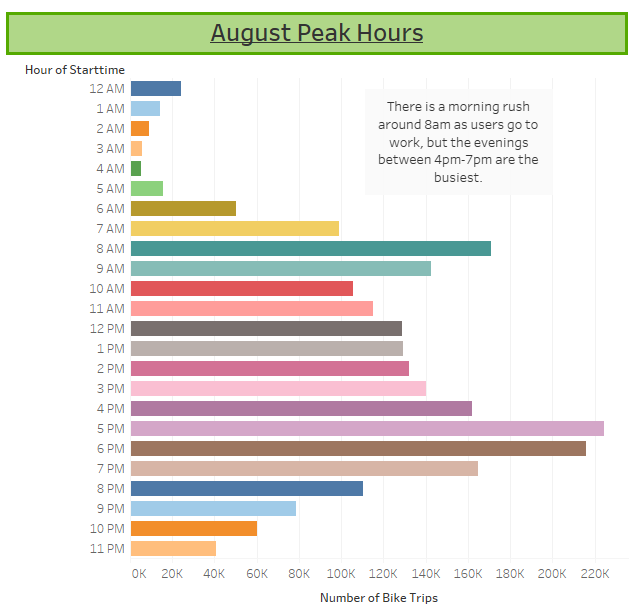
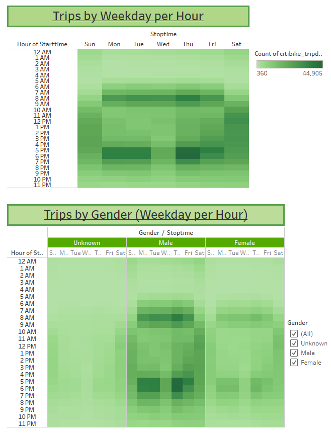

# Bike_Sharing
NY Citibike with Tableau

## Overview of the Analysis
### Purpose
The purpose of this analysis is to explore data from Citi Bike, a bike sharing company, to see if bike sharing could expand its territory to Des Moines, Iowa. Citi Bike data was taken from New York during the month of August. Tableau was used to visualize this data set to convince investors to that bringing the bike share program to Des Moines would be a realistic and solid business model.
### Resources
-	Tableau was used to create a [data visualization story](https://public.tableau.com/app/profile/nik.walker/viz/BikesharingChallengeStory_16768402729470/CitiBikeAnalysis?publish=yes)

## Results

#### Citi Bike User Overview

The collected data and following analysis was based on 2.34 milion rides, in New York during August. An 81% majority of rides were taken by subscribers of Citi Bike. The User Trips heat map shows that of subscribers, people who identify as male ride the most. Male and female subscribers tend to ride mostly during the work week, with Thursdays and Fridays being the busiest. For users that do not pay for the subscription tend to ride more on the weekends. 

#### Riders by Gender

People who Identify as male make up just over 65% of Citi Bike users. Whereas female identifying people make up 25% of users. Gender does not seem to correlate with the ages of users. However, it seems that regardless of gender, bikers that use the service most are those in their early to mid-thirties. 

#### August Peak Hours

The above graph shows the hours of the day in which the most bikes are rented. There is a strong correlation with beginning and ending working hours. There is a high number of bikes rented during the 8am hour suggesting travel to work. Towards the end of the day there is a rise in rentals between 4pm and 7pm with the most rented during the 5 o’clock hour. In general, this seems to follow a nine to five workday.  

#### Checkout Durations 

Most users seem to get to there destination within 10 minutes. The mean ride time is around five minutes. Based on gender the ride times seem to be relatively the same. The average ride for males was five minutes, and six minutes for females. For people of an unknown gender, there seemed to be a more even spread of rides ranging from 7 to 27 minutes.  
#### Tripcounts by Weekday and Hour

The “Trips by Weekday per Hour” heatmap shows that bikes were mostly used in the mornings around 8am and the evening from 5pm to 6pm, Monday through Friday. During the week there is a slight lull of bikes being used on Wednesdays. On the weekends however, bike seem to be rented evenly throughout the day between the hours of 10am and 5pm. This seems to be the trend regardless of gender.
## Summary
### Points of Interest

When examining if Citi Bike would be a good fit in Des Moines, there are a few things to consider. Firstly, the spread of the city should be taken into account. Can riders get to their destionation within ten minutes? Most rides are only 5 minutes in length. From the New York data, Citi Bike does seem to have a good business model with 81% of rides being taken by payed subscribers. Subcribers ride during the work week, to and from work, which seems to follow a nine to five workday. A higher amount of customers without subscriptions ride on the weekends, possibly suggesting they are likely riding for recreation or could be tourists in the city. Reguardless of gender, the average age of bikers are those in there early thirties, which seems to suggest they are of working age for a business job. A 65% majority of bikers are male. Male customers in there early thirties that have a nine to five job seem the make up a big portion of the target audience.
  
### Recommendations
As seen above in the "Riders by Gender" section, an additional graph was made to determine the target age of customers by gender. It would further be reccomended to calcutate and chart the distances between the start and end points of the ride to get and idea about the distances traveled. 
